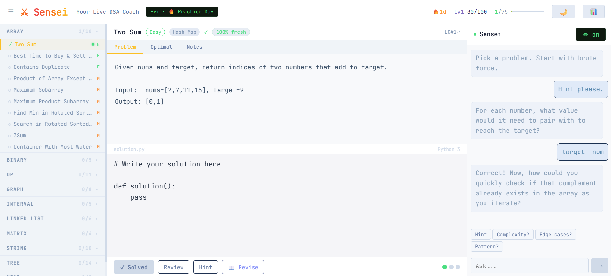

# ⚔ Sensei · (A)live DSA Coach

> AI-powered mentor for **Blind 75** — the famous set of 75 LeetCode problems every software engineer needs to master for technical interviews at FAANG and top tech companies.

[](LICENSE)
[](package.json)
[](#)
[](https://anthropic.com)

Sensei watches your code as you type, nudges you when you're stuck, asks Socratic questions instead of handing out answers, verifies your solution before marking it solved, and tracks your fluency over time using spaced repetition — so you actually retain what you learn.

**Stop grinding LeetCode blindly. Get coached.**



---

## What is Blind 75?

The **Blind 75** is a curated list of 75 LeetCode problems, originally shared on the Blind job board, that covers every major Data Structures and Algorithms pattern tested in software engineering interviews:

`Arrays` · `Binary Search` · `Dynamic Programming` · `Trees` · `Graphs` · `Linked Lists` · `Intervals` · `Matrix` · `Strings` · `Heap / Priority Queue`

Mastering these 75 problems gives you coverage of ~90% of interview questions at Google, Meta, Amazon, Apple, Netflix, and Microsoft.

---

## Features

- **GitHub SSO**: sign in with GitHub — per-user progress, no passwords
- **All 75 problems** with optimal solutions (NeetCode-curated), each tagged with pattern and difficulty
- **Live AI coaching**: Sensei watches whenever your cursor is in the editor (5s inactivity check); re-nudges every 10s if a question goes unanswered
- **Socratic method**: hints and reviews guide you toward the answer — never just give it away
- **AI-gated submissions**: solution only marked solved after Claude verifies it with ✓
- **Test case runner**: run your code against custom inputs directly in the browser
- **Spaced repetition**: confidence decay, revision queue, cold-solve detection
- **Revision mode**: 20-min timed cold solve, no hints — proves real retention
- XP system, daily streaks, per-category progress, fluency badges
- **SQLite persistence**: progress saved server-side per user, survives page refreshes
- Light / dark mode · Resizable code editor · Auto-growing chat input

---

## Setup

1. Install dependencies:
   ```bash
   npm install
   ```

2. Create `.env`:
   ```bash
   cp .env.example .env
   ```

3. [Create a GitHub OAuth App](https://github.com/settings/developers) and fill in `.env`:
   ```
   ANTHROPIC_API_KEY=sk-ant-...
   GITHUB_CLIENT_ID=<from GitHub>
   GITHUB_CLIENT_SECRET=<from GitHub>
   GITHUB_CALLBACK_URL=http://localhost:3001/auth/github/callback
   SESSION_SECRET=<node -e "console.log(require('crypto').randomBytes(32).toString('hex'))">
   ```

4. Start:
   ```bash
   npm run dev
   ```

The API key stays in `.env` — never bundled, never in the browser, never committed.

---

## Security

- API key is server-side only (never reaches the browser)
- All API routes require GitHub session authentication
- **Sessions persist across server restarts** via SQLite-backed session store (no in-memory loss)
- Rate limiting: 60 req/min per IP
- Helmet security headers on all responses
- Body size capped at 16 KB
- Code runner: 5s timeout, subprocess isolation

---

## Deployment (Railway)

1. Push to GitHub
2. Connect repo in Railway → set environment variables:
   - `ANTHROPIC_API_KEY`
   - `GITHUB_CLIENT_ID` + `GITHUB_CLIENT_SECRET` + `GITHUB_CALLBACK_URL`
   - `SESSION_SECRET`
3. Add a Volume mounted at `/app/data` for SQLite persistence

---

## Stack

| Layer | Technology |
|---|---|
| Frontend | React 18 + Vite |
| Backend | Express.js (API proxy) |
| AI — coaching | Claude Sonnet 4.6 |
| AI — live peek | Claude Haiku 4.5 (cost-optimised) |
| Database | SQLite via `better-sqlite3` |
| Tests | Vitest + Supertest (47 tests) |
| Hosting | Railway |

> SQLite → PostgreSQL migration path: swap two functions in `db.js`. Nothing else changes.

---

## Scripts

| Command | Description |
|---|---|
| `npm run dev` | Start dev server (Vite + Express) |
| `npm run build` | Production build |
| `npm start` | Run production server |
| `npm test` | Run all 47 tests |
| `npm run gen-token` | Generate a secure random token |

---

## Keywords

`blind75` · `leetcode` · `dsa` · `data structures` · `algorithms` · `interview prep` · `coding interview` · `faang` · `dynamic programming` · `binary search` · `trees` · `graphs` · `react` · `claude ai` · `anthropic` · `spaced repetition`
